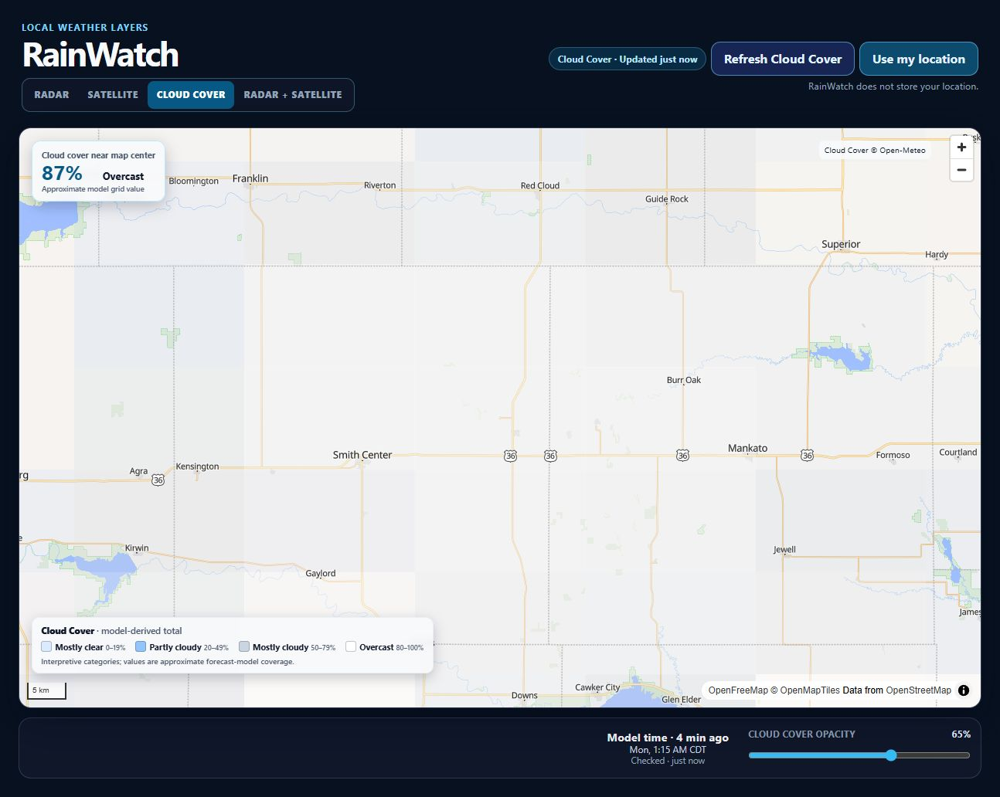
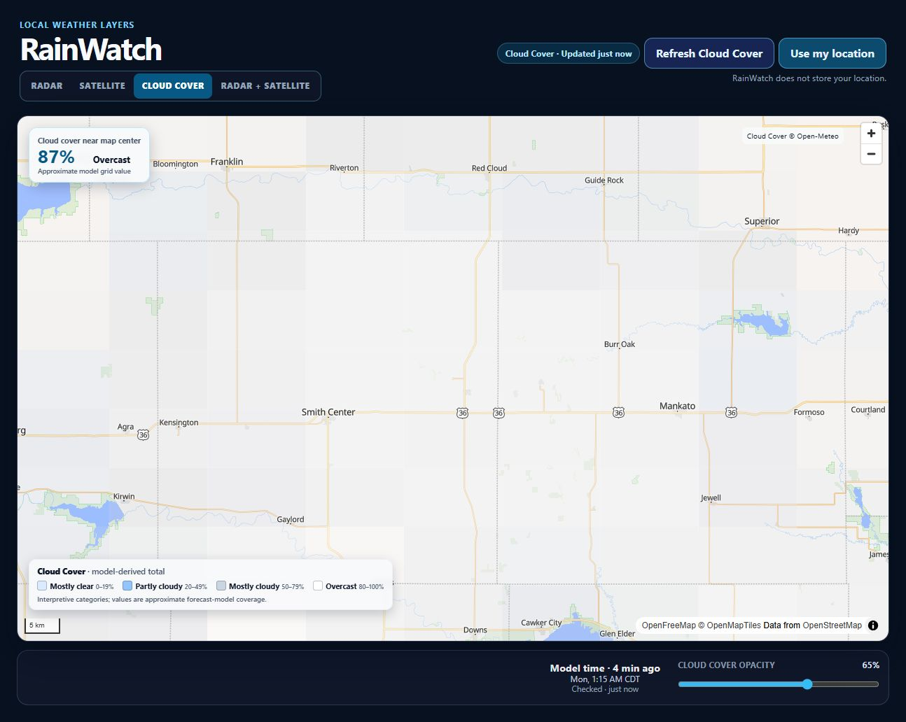
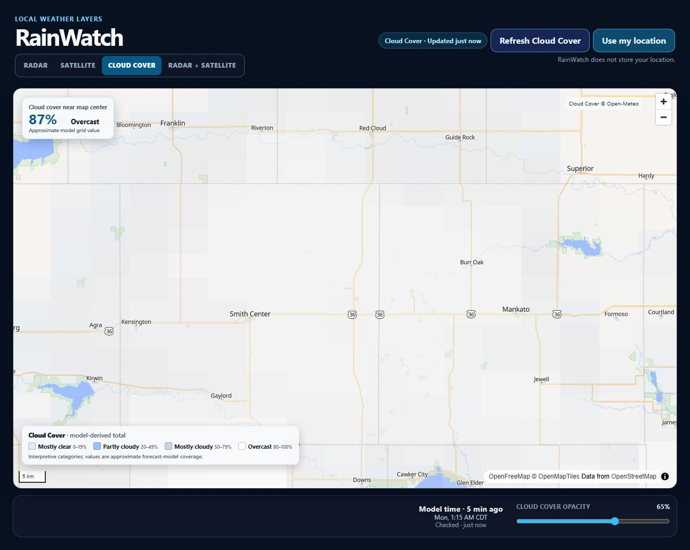
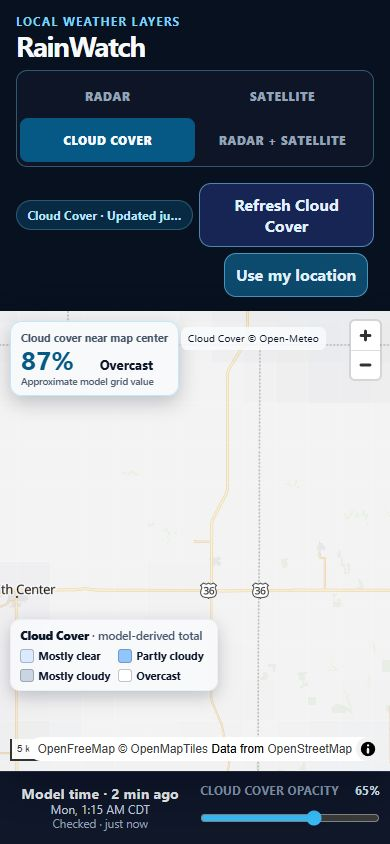

# RainWatch Cloud Cover sampling-density experiment

This focused evaluation follows the deployed Version 0.2c release. It tests whether denser Open-Meteo sampling makes the existing rectangular, non-interpolated Cloud Cover layer useful enough on its own. It does not change the default 5 × 5 / 7 × 7 behavior and does not add interpolation, smoothing, a heatmap, or a new user-facing setting.

## Test mechanism

The temporary `cloudGrid` query parameter fixes both grid dimensions for one page load:

- `?cloudGrid=7`
- `?cloudGrid=11`
- `?cloudGrid=15`
- `?cloudGrid=21`

Other values are ignored, so a normal URL retains Version 0.2c's zoom-based 5 × 5 / 7 × 7 sampling. Instrumentation on the map panel records sample count, HTTP request count, request URL length, decoded response bytes, provider response time, grid-processing time, and the synchronous MapLibre source/layer update time.

## Controlled regional measurement

All four measurements below used the same central-US map center and regional zoom. Times are individual live browser observations rather than benchmarks; network latency varied independently of density.

| Density | Points | HTTP requests | URL length | Response size | Provider response | Grid processing | MapLibre update | Visible load |
| --- | ---: | ---: | ---: | ---: | ---: | ---: | ---: | ---: |
| 7 × 7 | 49 | 1 | 964 chars | 15.7 KiB | 589 ms | 0.2 ms | 2.5 ms | 881 ms |
| 11 × 11 | 121 | 1 | 2,211 chars | 38.7 KiB | 165 ms | 0.3 ms | 2.1 ms | 424 ms |
| 15 × 15 | 225 | 1 | 4,025 chars | 72.1 KiB | 186 ms | 0.5 ms | 4.2 ms | 426 ms |
| 21 × 21 | 441 | 1 | 7,775 chars | 141.5 KiB | 208 ms | 0.4 ms | 2.2 ms | 384 ms |

The 7 × 7 response was the slowest in this run, demonstrating that one timing sample should not be treated as a monotonic density cost. Parsing and MapLibre updates remained only a few milliseconds at every density; transfer size and provider workload are the meaningful costs.

## API behavior and practical limits

Open-Meteo's documented multiple-location syntax uses comma-separated latitude and longitude lists. All four densities worked as one HTTP request when commas remained literal URL separators.

The first 21 × 21 attempt exposed a practical URL-encoding limit:

- `URLSearchParams` encoded each comma as `%2C`, producing a 9,535-character application request that failed in the browser.
- A separate 9,808-character encoded diagnostic request returned HTTP 414 `Request-URI Too Large` from nginx.
- The equivalent diagnostic request with literal commas was 8,048 characters and returned HTTP 200, 144,966 bytes, in 766 ms.
- RainWatch now keeps the valid commas literal. The controlled application request was 7,775 characters and returned all 441 values in one request.

Rapid repeated testing also produced HTTP 429 responses. This occurred during a burst of viewport comparisons and again when a successful 21 × 21 mobile pan was immediately followed by another zoom request. RainWatch correctly kept the last available grid and displayed its existing non-blocking refresh error. The response did not explain its usage calculation, so this experiment does not claim that 441 coordinates equal 441 billable calls. It does show that one batched HTTP request does not guarantee equal practical provider cost or burst reliability across densities.

Official references:

- Open-Meteo forecast documentation: <https://open-meteo.com/en/docs>
- Open-Meteo pricing and free-tier limits: <https://open-meteo.com/en/pricing>

## Visual comparison

The following screenshots preserve the rendering method, colors, opacity, center, and local extent. Only sampling density changes.

### 7 × 7

Large rectangles dominate the field. Broad differences are visible, but the layer reads as blocks placed over a map.

### 11 × 11

The largest block effect is reduced. Regional variation becomes easier to follow, though the checkerboard remains obvious.

### 15 × 15

This is the clearest cost/clarity compromise. It communicates broad cloudier and clearer areas without the transfer size of 21 × 21, but it still does not look like a cloud field.

### 21 × 21

Cells are smaller, but their rectangular boundaries remain visible. The extra detail is modest compared with 15 × 15 while the response is roughly twice as large.

At the whole-USA scale, denser grids add more regional samples but do not remove the artificial cell boundaries. At local scale, 15 × 15 and 21 × 21 make each cell geographically smaller, yet both still present a tiled field. The observed weather during this run was broadly overcast across the local comparison area, so neighboring values were similar and the visual improvement from 15 × 15 to 21 × 21 was especially small.

## Interaction and mobile observations

- First loading and switching into Cloud Cover remained visually responsive for all four successful regional runs.
- Completed pans and zooms kept the existing 350 ms debounce, meaningful-move threshold, ten-minute viewport reuse, and one-request behavior.
- A 21 × 21 mobile pan completed a fresh one-request update in about 2.0 seconds including the gesture, move completion, debounce, network, and rendering.
- An immediately following 21 × 21 zoom received HTTP 429; the map remained interactive and retained its last grid.
- At 390 × 844, both 15 × 15 and 21 × 21 rendered smoothly. Controls remained usable, the four modes retained their 2 × 2 layout, and no obvious memory or CPU abnormality appeared.
- Browser inspection found no RainWatch application errors during successful runs. The development server did surface recurring OpenFreeMap/MapLibre boundary-filter warnings and temporary glyph-fetch warnings; these did not prevent the map, labels, or controls from rendering.

Mobile reference:

## Recommendation

**Recommendation E: sampling alone is insufficient; a future explicitly authorized milestone should evaluate interpolation or smoothing.**

If RainWatch must remain cell-based, 15 × 15 is the preferred experimental ceiling:

- It is visibly more useful than 7 × 7 and somewhat clearer than 11 × 11.
- It uses one approximately 72 KiB response at the tested regional extent.
- 21 × 21 roughly doubles the response to 142 KiB with only a modest visual improvement.
- Neither 15 × 15 nor 21 × 21 removes the checkerboard interpretation problem.

The deployed/default Version 0.2c density is intentionally unchanged pending a separate product decision.

## Files changed

- `src/App.tsx`
- `src/components/WeatherMap.tsx`
- `src/config/cloudCover.ts`
- `src/hooks/useCloudCover.ts`
- `src/services/cloudCover/CloudCoverProvider.ts`
- `src/services/cloudCover/OpenMeteoCloudCoverProvider.ts`
- `src/services/cloudCover/OpenMeteoCloudCoverProvider.test.ts`
- `src/types/weather.ts`
- `src/utils/cloudCoverGrid.ts`
- `src/utils/cloudCoverGrid.test.ts`
- `README.md`
- `progress.html`
- `docs/journal/2026-09-14-cloud-density-experiment.md`
- `docs/screenshots/cloud-density-experiment/`

## Verification

- Nine automated grid/provider tests passed.
- `npm run lint` passed with no warnings.
- `npm run build` passed; only the existing MapLibre bundle-size advisory remained.
- Radar, Satellite, Radar + Satellite, Cloud Cover, geolocation controls, freshness labels, opacity controls, and mobile layout remained present.
- No real device location was requested or transmitted.
