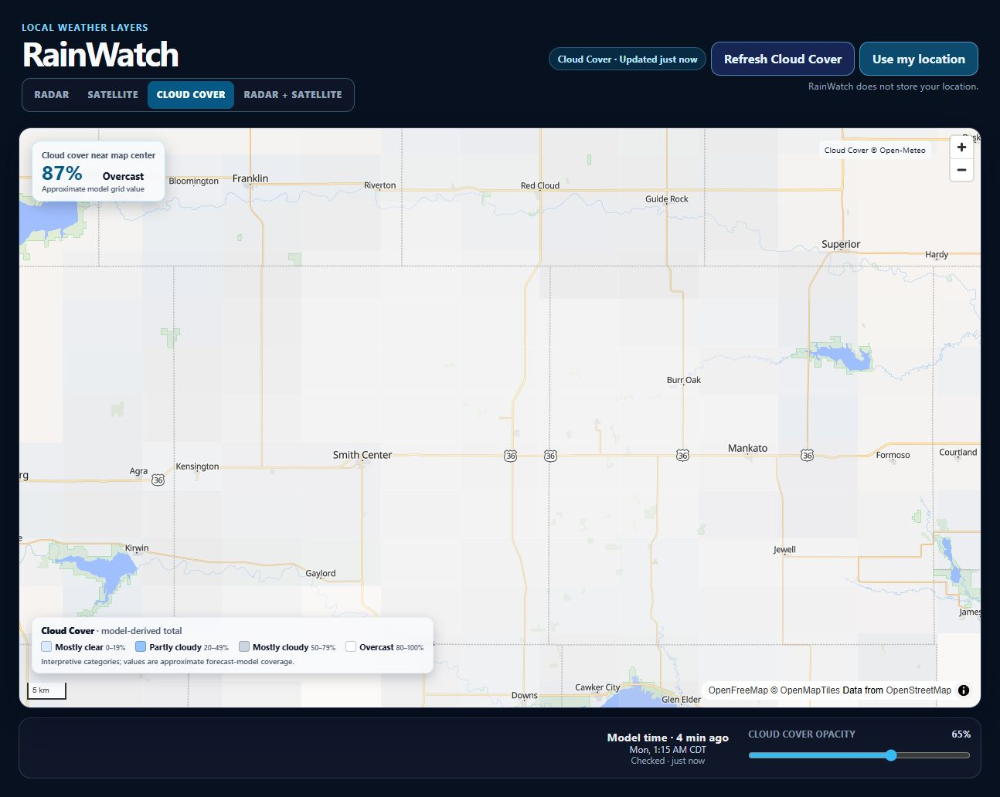
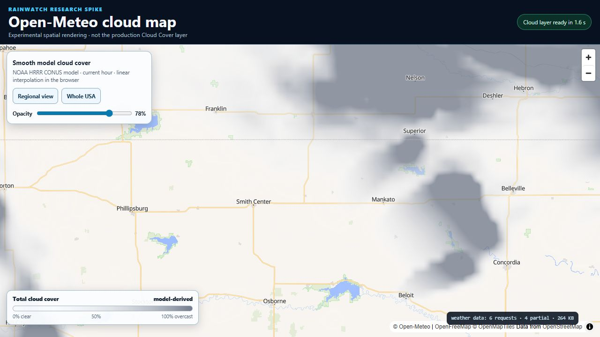
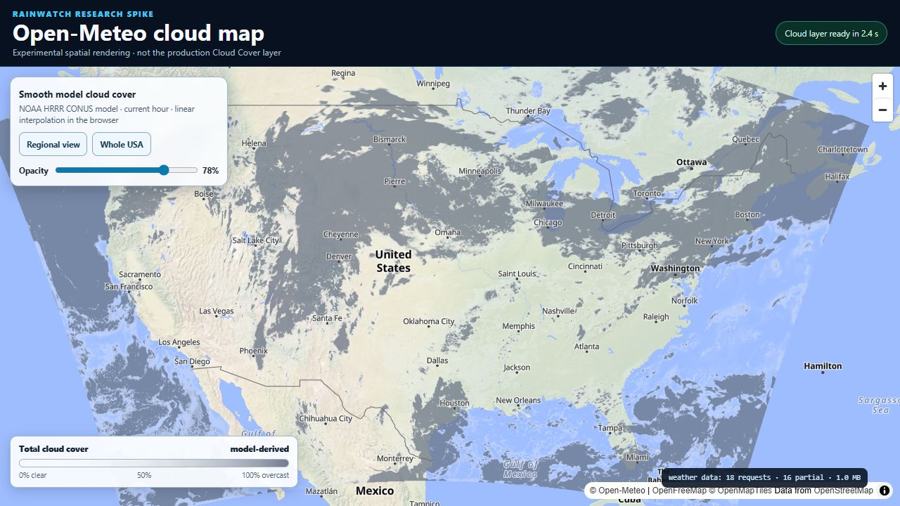
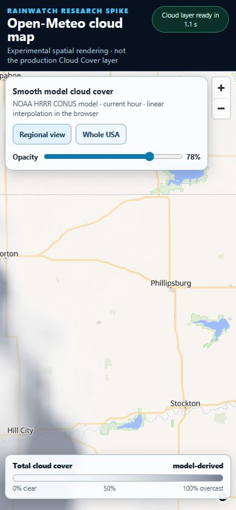
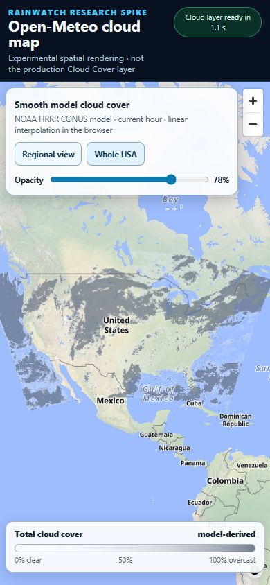

# Open-Meteo Weather Map Layer cloud-cover spike

This research spike asks whether Open-Meteo's official spatial weather-map tooling can replace RainWatch's visibly rectangular sampled Cloud Cover grid. It adds a removable standalone experiment and does **not** change the deployed Cloud Cover mode, provider, defaults, or tests.

## Official components investigated

- [`open-meteo/weather-map-layer`](https://github.com/open-meteo/weather-map-layer): the `@openmeteo/weather-map-layer` package and its MapLibre `om://` protocol, raster renderer, interpolation options, color scales, partial-request example, and production-readiness notice.
- [`open-meteo/maps`](https://github.com/open-meteo/maps) and [maps.open-meteo.com](https://maps.open-meteo.com/): Open-Meteo's own browser map and its endpoint/fallback strategy.
- [Weather Map Layer releases](https://github.com/open-meteo/weather-map-layer/releases): interpolation and color blending arrived in 0.0.20; the repository is now on the 0.1 line.
- [Open-Meteo forecast documentation](https://open-meteo.com/en/docs) and [GFS/HRRR documentation](https://open-meteo.com/en/docs/gfs-api): meaning, resolution, coverage, and update cadence of model-derived total cloud cover.
- [Open-Meteo licence page](https://open-meteo.com/en/licence): data attribution and underlying-provider licensing.

The checked-out package source reported version `0.1.1`. Its README explicitly says the package is under construction, not fully production-ready, may change APIs, and may have incomplete features. The package code is GPL-2.0; Open-Meteo API data are CC BY 4.0 and require adjacent attribution.

## How the official rendering path works

The system does not call the familiar point forecast endpoint and does not ask RainWatch to build a raster:

1. A small `latest.json` document identifies the current model run and valid-time `.om` file.
2. The browser sends one `HEAD` request for that file.
3. The custom `om://` MapLibre protocol reads only required 64 KiB byte ranges from the `.om` file using HTTP 206 requests.
4. `updateCurrentBounds()` restricts reads to the visible geographic area.
5. A browser worker decodes the model grid and produces MapLibre raster tiles.
6. Linear grid interpolation and color blending create a continuous-looking field; the official `cloud_cover` scale uses 10-percentage-point breakpoints from 0 through 90 percent with increasing gray opacity.

The experiment uses:

- the existing OpenFreeMap MapLibre basemap;
- `@openmeteo/weather-map-layer@0.1.1` and MapLibre 6.10.0 from pinned CDN URLs;
- Open-Meteo's raw S3 spatial endpoint;
- NOAA HRRR CONUS `cloud_cover`, current hour;
- `interpolation=linear` and `color_blend=true`;
- an ordinary MapLibre raster source and layer below the first label layer;
- 78 percent default opacity.

HRRR was selected instead of the README's default global DWD ICON example because RainWatch's present product area is the United States and Open-Meteo exposes the official HRRR spatial domain. HRRR offers roughly 3 km CONUS model resolution and hourly updates, while DWD ICON global is roughly 11 km and updates every six hours. `cloud_cover`, `cloud_cover_low`, `cloud_cover_mid`, and `cloud_cover_high` were all present in live HRRR metadata.

## Visual comparison

### Current sampled grid: 15 × 15

The cell grid communicates broad differences, but rectangular boundaries remain obvious even at the best tested density. More points make smaller rectangles rather than a weather-shaped field.

### Official map layer: regional

The official renderer removes the checkerboard. Clear/cloudy transitions become spatial shapes and the answer to “Is there cloud cover around this location?” is much faster to read. At close zoom, some stepped native-model structure remains; interpolation smooths the pixels but does not create real precision beyond HRRR's grid.

### Official map layer: whole USA

At national scale, cloud bands and large clear areas are immediately legible. Labels remain above the raster and readable at 78 percent opacity. The opacity slider behaves smoothly without fetching replacement data.

### Mobile, 390 × 844

The map, zoom controls, view buttons, opacity slider, legend, and attribution remained usable with no horizontal overflow. The tall phone aspect naturally includes more Canada, Mexico, and adjacent ocean when fitting the whole continental U.S.

## Network measurements

Measurements are live browser observations from 2026-09-17, not long-run benchmarks. Byte totals count response bodies advertised by successful `GET` requests; the full `.om` size reported by `HEAD` is not counted as transferred data.

| View/action | Requests | Successful range reads | Transferred weather data | Cloud source ready |
| --- | ---: | ---: | ---: | ---: |
| Fresh regional HRRR view | 6 | 4 | 264 KiB | 1.6 s |
| Fresh whole-USA HRRR view | 18 | 16 | about 1.0 MiB | 2.4 s |
| One-level regional zoom in | +0 | +0 | +0 | remained interactive |
| Pan far enough to enter a new model-data band | +1 | +1 | +64 KiB | no visible interruption |
| Return to the already viewed area | +0 | +0 | +0 | reused in-memory data |

The six regional requests were one metadata `GET` (7,891 bytes), one `.om` `HEAD`, and four 65,536-byte range `GET`s. The whole-USA view used the same metadata/HEAD pattern plus sixteen ranges. A brief DWD ICON comparison used about 198 KiB regionally and 1.1 MiB nationally; model layout, not only geographic area, affects range count.

For comparison, the current sampled grid measured one forecast API request and about 72.1 KiB at 15 × 15. The official HRRR layer therefore cost about 3.7 times as many regional bytes and roughly fourteen times as many national bytes as that regional 15 × 15 reference, but it delivered much better spatial readability.

Tiles appeared progressively as range reads completed. Normal pans and zooms stayed smooth. Rapidly switching extents caused obsolete fetches to be aborted and replacement ranges to start; that is desirable cancellation behavior, although raw request-attempt counts can look noisy during such transitions.

## Rate limits and freshness

- The experiment does not use `api.open-meteo.com/v1/forecast`, so it does not share the current sampled grid's request shape.
- It uses `openmeteo.s3.amazonaws.com/data_spatial` and partial `.om` reads. The official Maps source describes raw S3 as uncached and slower but not rate-limited, while its preferred `data-spatial.open-meteo.com` endpoint is rate-limited and restricted by referrer for the official app.
- No HTTP 429 or throttling occurred during realistic loads, pans, zooms, reloads, and mobile checks. No stress test was performed.
- The timestamped `.om` URL changes with model run/valid time. `latest.json` is fetched again on a new page load, while already read ranges are reused within the page.

## Performance observations

- Regional first render was approximately 1.6 seconds; whole-USA was approximately 2.4 seconds in the recorded HRRR runs.
- Pan and zoom interactions remained fluid on desktop and at 390 × 844.
- Raster generation is client-side, but no sustained CPU spike, interaction lag, or notable memory growth was visible in ordinary use.
- Whole-USA rendering requires more parallel 64 KiB reads and visibly fills in by area; regional use is lighter.
- Browser inspection found no application warnings or errors in the successful runs.

## GitHub Pages and PWA compatibility

- The production Vite build passed and copied the standalone page to `dist/experiments/open-meteo-cloud-map.html`.
- The page worked at the production-style `/rainwatch/experiments/open-meteo-cloud-map.html` base path.
- Open-Meteo S3, UNPKG, and OpenFreeMap all accepted browser requests with CORS; no API key, backend proxy, database, or special hosting was required.
- The generated service worker precaches the experiment HTML because HTML is part of the existing app-shell glob. External scripts and live `.om` data are not added to a persistent weather-data cache.
- A browser still controlled by the previous service worker returned the main RainWatch shell on the first direct experimental-page navigation. After the worker updated, one reload served the experiment correctly. A production migration should avoid a standalone navigation outside the app router or explicitly exclude such routes from the app-shell navigation fallback.
- Static HTTPS hosting is technically compatible, but live clouds still require network access. CDN dependencies should be bundled locally before a production migration.

## Production-readiness risks

1. **Upstream warning:** Open-Meteo explicitly says the map-layer package is not fully production-ready.
2. **Pre-1.0 API churn:** version 0.1.x and a recent breaking release make maintenance changes likely.
3. **Licence review:** the rendering package is GPL-2.0, while the data are CC BY 4.0 with required attribution. RainWatch should choose and document a compatible project licence before bundling this code into production.
4. **Higher transfer:** the visual improvement costs materially more than the sampled JSON grid, especially at national scale.
5. **Client workload:** decoding and rasterizing model data moves work into the browser. It performed well in this check, but lower-end real devices remain unverified.
6. **Raw-endpoint contract:** the public S3 layout works today but is less of a stable product contract than the documented forecast API.
7. **Dependency delivery:** the removable spike uses pinned CDN assets. A real migration should install, lock, bundle, and security-review the package instead.
8. **Model choice:** HRRR is excellent for CONUS but does not solve global coverage. A production design needs an explicit fallback model outside its domain.

## Recommendation

**C. Keep the current implementation for now.**

The official map-layer approach is the first tested option that clearly solves the checkerboard problem, integrates naturally with MapLibre, and works in a static browser-only architecture. It is the leading candidate for a future replacement. It should not yet become RainWatch's default because the upstream package disclaims production readiness, remains pre-1.0, carries a GPL-2.0 integration decision, costs substantially more data, and exposed a standalone-route service-worker edge case.

Revisit option A after Open-Meteo declares the package production-ready or RainWatch explicitly accepts and mitigates those risks. A future authorized migration spike should bundle the dependency, settle licensing, choose HRRR plus a non-CONUS fallback, add a PWA navigation strategy, and test on a lower-end real phone.

## Files added or changed

- `public/experiments/open-meteo-cloud-map.html`
- `docs/journal/2026-09-17-open-meteo-map-spike.md`
- `docs/screenshots/open-meteo-map-spike/`
- `README.md`
- `progress.html`

Production React components, the current Open-Meteo forecast provider, Cloud Cover mode, default grid behavior, and existing tests remain unchanged.

## Verification

- `npm run build` passed; only the existing MapLibre bundle-size advisory remained.
- `npm run lint` passed with no warnings.
- All nine existing automated tests passed.
- Desktop regional and whole-USA browser checks passed.
- 390 × 844 regional and whole-USA browser checks passed.
- Production `/rainwatch/` base-path check passed after the service-worker update behavior described above.
- No real device location was requested or transmitted.
